# Brazilian Football League (2003-2021) EDA
#### _Marcelo de Campos Machado_

## Data Analysis with R

This is an article about the history of the Brazilian Football League's first division between the year of 2003 and 2021. :soccer:

In 2003 the tournament changed its system to a _**round-robin**_ tournament (or all-play-all tournament), which is a competition in which each team competes against every other participant. Before the round-robin system, the Brazilian Football League was played in a cup system, with a group stage; only a few teams would qualify to the next round - followed by a knock-out stage - where the teams that lost were eliminated.

In the current system, at the end of each match, the winning team is awarded three points and the losing team receives zero. If the match results in a tie, both teams are awarded one point.

The team that accumulates the highest sum of points will automatically be the champion. :trophy: The bottom four teams are automatically relegated to the second division.

## CLEANING AND FORMATTING DATA

For this analysis, two datasets were utilized. The first provided data from the seasons of 2003-2020. For the most up-to-date analysis, the second dataset was scraped from the web, with the data of the season of 2021. Before analyzing the data, some unnecessary columns were removed and translated to English from Portuguese. 

The programming code used for cleaning and for this analysis is available here: 

> [Code](https://github.com/marcelocmachado/BrazilianFootball/blob/main/BrazilianFootball_code.md) 

Let's get to the analysis! :bar_chart::chart_with_upwards_trend:

## APPEARENCES

The Brazilian Football League First division has been played by 46 different clubs during its round-robin system era (03-21). 

The top 15 teams that participated in most seasons are displayed in the graph below:

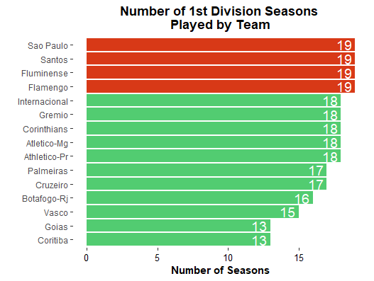

We can notice that only 4 teams - **Flamengo**, **Fluminense**, **Santos** and **Sao Paulo** - have participated in all First Division Seasons (2003-2021).

In 2003 and 2004, 24 teams played the First Division. The objective after those years was to adopt the same format as most European leagues, such as the Premier League (England), La Liga (Spain), Serie A (Italy) and the Ligue 1 (France), with 20 teams participating. 2005 was a transitional year - with 22 teams - and finally, from 2006 until today, the tournament has 20 teams. Since not all clubs have same amount of games played in the First Division tournament - some got relegated and some were promoted to the First Division after 2003 - we have to find out the total number of games played to help us on further analysis.

The table below shows the teams with the most appearences in the First Division.

|    |    **Team**   | **Appearences** |
|:--:|:-------------:|:---------------:|
|  1 |    Flamengo   |       742       |
|  2 |   Fluminense  |       742       |
|  3 |     Santos    |       742       |
|  4 |   Sao Paulo   |       742       |
|  5 |  Athletico-PR |       704       |
|  6 |  Atletico-MG  |       704       |
|  7 |  Corinthians  |       704       |
|  8 | Internacional |       704       |
|  9 |     Gremio    |       700       |
| 10 |    Cruzeiro   |       666       |

In the last season (2021), all the teams from the table above played in the Brazilian First Division with the exception of Cruzeiro - which has been relagated in the year of 2019, five years after their last League Title.

## GOALS

Goals are the main essence of football's existence. Scoring a goal is the most exciting moments of the game. The feeling of seeing the ball hit the back of the net and win the game for your team is a remarkable experience.:raised_hands:

### Home vs Away goal performance

The following table shows the sum of goals in each season scored by all teams combined playing at home and away, and the total. By doing a simple calculation, we come up with the percentage of goals scored home and away.

| **Season** | **homeGoals** | **awayGoals** | **totalGoals** | **homeGoals %**     | **awayGoals %**    |
|:--------:|:-----------:|:-----------:|:------------:|:-------------:|:-------------:|
| 2003   | 982       | 610       | 1592       | 61.68341709 | 38.31658291 |
| 2004   | 947       | 587       | 1534       | 61.73402868 | 38.26597132 |
| 2005   | 835       | 616       | 1451       | 57.54651964 | 42.45348036 |
| 2006   | 604       | 426       | 1030       | 58.6407767  | 41.3592233  |
| 2007   | 634       | 413       | 1047       | 60.55396371 | 39.44603629 |
| 2008   | 658       | 377       | 1035       | 63.57487923 | 36.42512077 |
| 2009   | 660       | 434       | 1094       | 60.32906764 | 39.67093236 |
| 2010   | 581       | 397       | 978        | 59.40695297 | 40.59304703 |
| 2011   | 610       | 407       | 1017       | 59.98033432 | 40.01966568 |
| 2012   | 559       | 380       | 939        | 59.5314164  | 40.4685836  |
| 2013   | 558       | 378       | 936        | 59.61538462 | 40.38461538 |
| 2014   | 540       | 320       | 860        | 62.79069767 | 37.20930233 |
| 2015   | 555       | 342       | 897        | 61.8729097  | 38.1270903  |
| 2016   | 564       | 348       | 912        | 61.84210526 | 38.15789474 |
| 2017   | 526       | 397       | 923        | 56.98808234 | 43.01191766 |
| 2018   | 525       | 302       | 827        | 63.48246675 | 36.51753325 |
| 2019   | 525       | 351       | 876        | 59.93150685 | 40.06849315 |
| 2020   | 536       | 408       | 944        | 56.77966102 | 43.22033898 |
| 2021   | 483       | 359       | 842        | 57.36342043 | 42.63657957 |

We can notice that in **ALL seasons** the teams playing home are responsible for the majority of the goals scored. 

### Average Home and Away goals across all seasons

| **homeGoals AVG (%)** | **awayGoals AVG (%)** |
|:---------------------:|:---------------------:|
|        60.19198       |        39.80802       |

 > 60% of goals scored across all seasons were scored by teams playing at home.

The following plot shows the gap between Home and Away goals across all seasons:

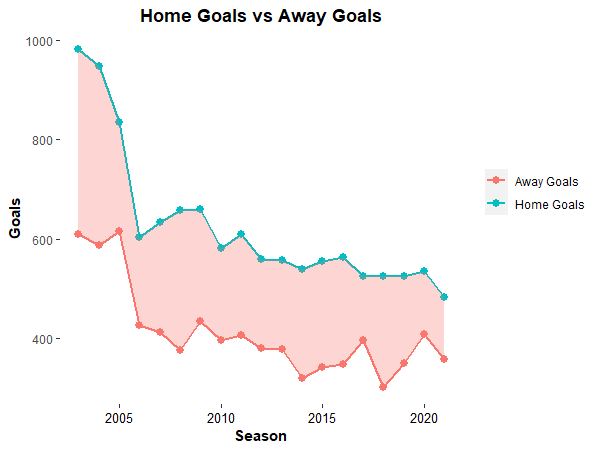

It's interesting to see that the year with the _**lowest home influence**_ in goal scoring was 2020, which makes sense since most of the games were not open to the public due to COVID, and the home team wouldn't have their supporters rooting for them.

| **Season** | **homeGoals (%)** | **awayGoals (%)** |
|:----------:|:-----------------:|:-----------------:|
|    2008    |      63.57488     |      36.42512     |
|    2020    |      56.77966     |      43.22034     |

In this analysis, the Goal Comparison bar plot displays Home, Away and Total goals per season: 

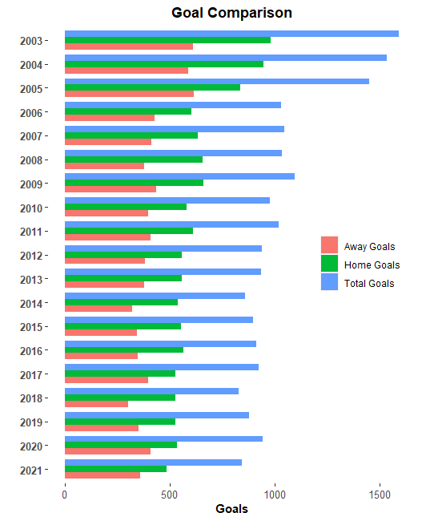

By looking at the graph above, we can see that the number of Total Goals is usually close to 1000. This pattern happens in all seasons with the exception of the first three (03-05), due to the greater number of teams competing in the championship in that period, as mentioned in the Appearences section. 

### Highest scoring teams across all seasons

Now let's see which teams score the most goals. In this analysis, we'll take a look at the top 10 teams with the best attacks of all editions.

|    | **Team**          | **HG**  | **AG**  | **Total** |
|:----:|:---------------:|:-----:|:-----:|-------:|
| 1  | Santos        | 674 | 421 | 1095  |
| 2  | Sao Paulo     | 624 | 444 | 1068  |
| 3  | Flamengo      | 616 | 437 | 1053  |
| 4  | Atletico-MG   | 624 | 410 | 1034  |
| 5  | Fluminense    | 555 | 429 | 984   |
| 6  | Cruzeiro      | 590 | 388 | 978   |
| 7  | Gremio        | 606 | 350 | 956   |
| 8  | Palmeiras     | 567 | 380 | 947   |
| 9  | Internacional | 565 | 372 | 937   |
| 10 | Athletico-PR  | 580 | 353 | 933   |

Santos, Sao Paulo and Flamengo figure at the top of the highest scoring teams of all time. Does it mean they are the most effective attacks? Not really. Teams haven't played the same amount of games. To evaluate the team's attacking power, we have to consider their average of goals scored per game played.

### Highest average goal scoring

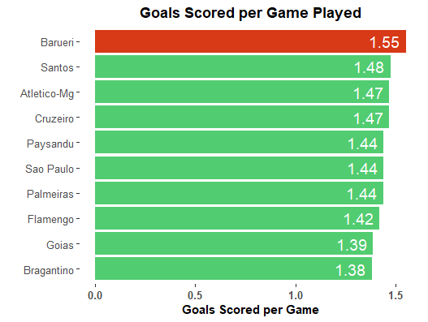

Curiously, Barueri has the highest average of goals per game. This team took part into the Brazilian League for only one season (2009), ending at the 11st position. After 2009, due to internal issues the team had to switch names and location. Santos, Cruzeiro and Atletico-MG follow Barueri with the highest average goal scoring.

### Best scoring teams per season

Our next analysis shows the best attacking teams per season. From 2006 onward, the best attacks scored close to 70 goals, with a clear outlier in 2019, when Flamengo scored 86 goals in 38 games, with the incredible average of 2.3 goals scored per game. Palmeiras and Flamengo are clearly dominating this category in the last few years, both leading the best attack for three consecutive years (Palmeiras - 16, 17, 18; Flamengo - 19, 20, 21).

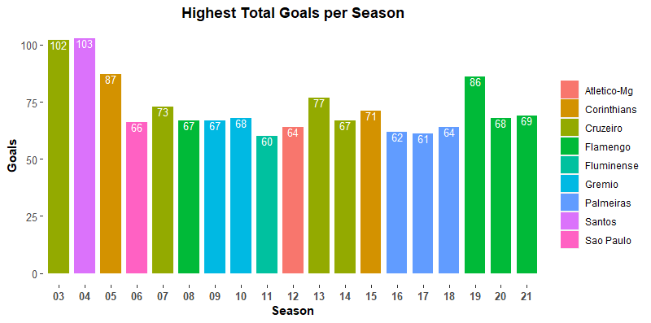

### Most ceded goals

As we have the best attacking teams, on the other hand we also have the teams with the poorest defences.

|    | **Team**        | **cededGoalsHome**  | **cededGoalsAway**  | **Total** |
|:----:|:-------------:|:-----:|:-----:|:-------:|
| 1  | Fluminense   | 380 | 564 | 944 |
| 2  | Atletico-Mg  | 374 | 535 | 909 |
| 3  | Flamengo     | 350 | 531 | 881 |
| 4  | Santos       | 342 | 535 | 877 |
| 5  | Athletico-Pr | 321 | 553 | 874 |
| 6  | Vasco        | 344 | 488 | 832 |
| 7  | Cruzeiro     | 356 | 462 | 818 |
| 8  | Botafogo-Rj  | 344 | 457 | 801 |
| 9  | Sao Paulo    | 318 | 481 | 799 |
| 10 | Palmeiras    | 344 | 436 | 780 |

Fluminense, Atletico-MG and Flamengo are at the top 3 clubs that conceded the highest amount of goals. As we've discussed previously, Fluminense and Flamengo have played all 19 seasons of the Brazilian First Division, therefore it makes sense that they would accumulate more goals conceded than most of the teams.

### Highest average ceded goals

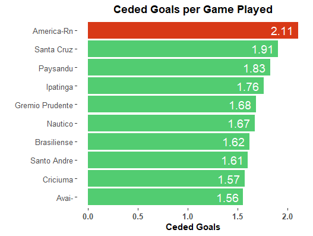

When we look at the averages, not a single team from the previous table figures in the Ceded Goals per Game Played graph. America-RN conceded the incredible count of 80 goals in 2007, leading our rank with the average of 2.11 goals ceded per game. It was the only season they played in the First Division in the period of 2003-2021. 

# RESULTS

In the Goal section introduction, we mentioned that the goals are the essence. But being the best attack is not the main objective, collecting points is. The only way to win the title is to be the team that accumulates the highest amount of points.

Our dataset did not show the points earned per game. It was necessary to assign the points to the Home and Away teams depending on the goal difference.
To recap, these were the points assigned:
1. Victory = 3 pts;
2. Defeat = 0 pts;
3. Draw = 1 pt.

Across nineteen seasons, among all 46 teams that played the tornament, only 9 were able to get the trophy in their hands.

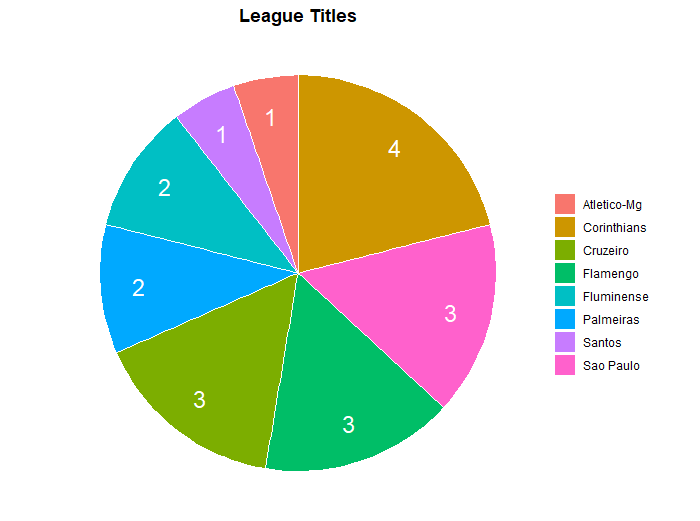

As shown above, Corinthians has been the most successful club in the history of the Brazilian Football league from 2003 to 2021 with 4 titles, representing close to 20% of possible titles. Coming up next are Sao Paulo, Cruzeiro and Flamengo, with 3 league titles each. 

The following table shows all the champions for each season, their total points and performance rate (total points / points possible):

| **Season** | **Champion**    | **Total Points** | **Performance Rate** |
|:--------:|:-------------:|:--------------:|:------------------:|
| 2003   | Cruzeiro    | 100          | 72.46%           |
| 2004   | Santos      | 89           | 64.49%           |
| 2005   | Corinthians | 81           | 64.29%           |
| 2006   | Sao Paulo   | 78           | 68.42%           |
| 2007   | Sao Paulo   | 77           | 67.54%           |
| 2008   | Sao Paulo   | 75           | 65.79%           |
| 2009   | Flamengo    | 67           | 58.77%           |
| 2010   | Fluminense  | 71           | 62.28%           |
| 2011   | Corinthians | 71           | 62.28%           |
| 2012   | Fluminense  | 77           | 67.54%           | 
| 2013   | Cruzeiro    | 76           | 66.67%           |
| 2014   | Cruzeiro    | 80           | 70.18%           |
| 2015   | Corinthians | 81           | 71.05%           |
| 2016   | Palmeiras   | 80           | 70.18%           |
| 2017   | Corinthians | 72           | 63.16%           |
| 2018   | Palmeiras   | 80           | 70.18%           |
| 2019   | Flamengo    | 90           | 78.95%           |
| 2020   | Flamengo    | 71           | 62.28%           |
| 2021   | Atletico-Mg | 84           | 73.68%           |

### Highest sum of points among champions

The graph below shows all of the champions total points across seasons:
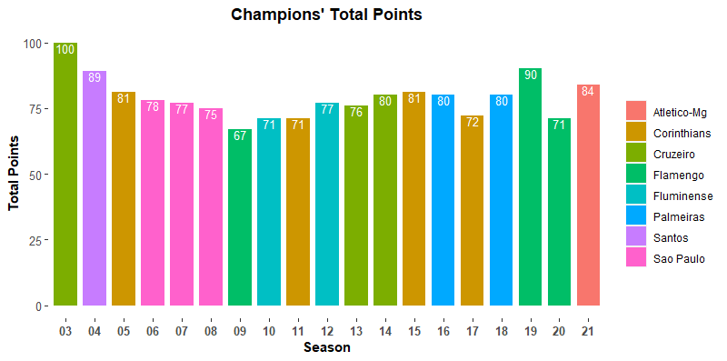

Cruzeiro, in 2003, and Flamengo, in 2009, have been, respectively, the champions with the highest and the lowest sum of points.

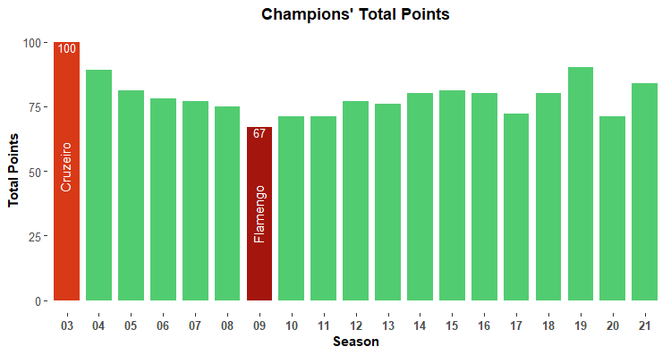

### Highest Performance Rate

We've seen that Cruzeiro had the campaign with the highest total points in 2003. However, we already know that at that time 24 teams were competing. So, who has the best and worst performances in terms of points gathered in relation to points possible?

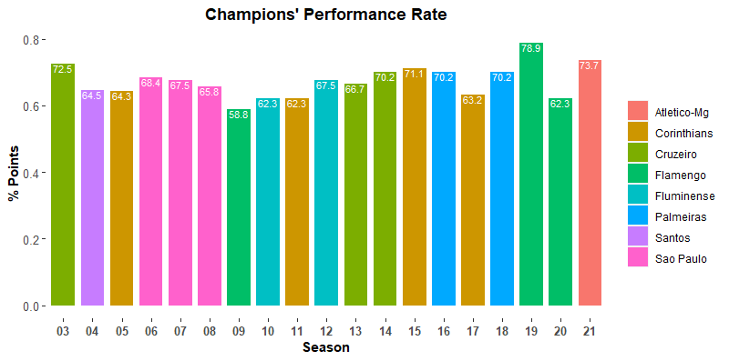

The graph above shows all the percentages of points acquired, and the graph below highlights the team with best and worst performances among champions:

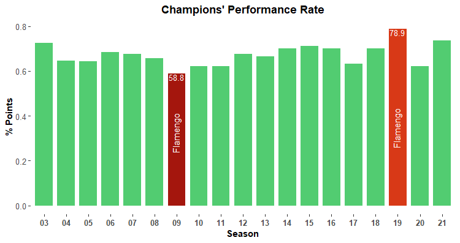

Flamengo had both the best and worst campaing among champions, winning in 2019 with the incredible performance of 78.9%. In contrast, in 2009 they were able to win the title by winning only 58.8% of the points possible.

# SUMMARY

The Brazilian League's First Division has been a pretty well balanced tournament. Although Corinthians is in the lead of league titles across these last 19 seasons, there is no clear domination. Unlike major European leagues such as Spain's La Liga where there is a clear dominance by Real Madrid and Barcelona, Brazil' tournament shows it is a much more plural league, making it more interesting and unpredictable since we can never know the outcome.

Flamengo, Fluminense, Santos and Sao Paulo have been able to maintain themselves in the First Division throughout all 19 seasons, and all of them were able to win titles during the period of 2003 2021.

Having recently received significant investments, Flamengo and Palmeiras were able to accomplish becoming the best attacks in the league for the last six years. Both teams were also able to win important continental titles and Brazilian cups (competitions that use the knock-out system) which shows how difficult it is to maintain consistency in round-robin tournaments.

